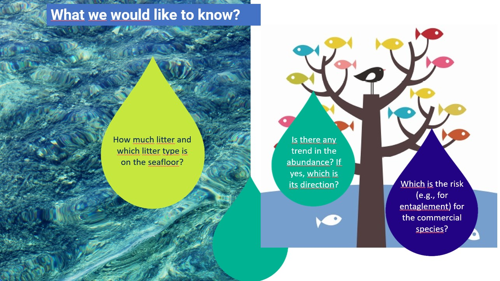
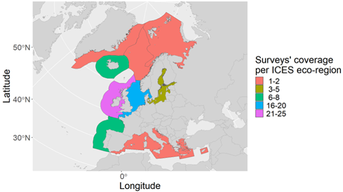

<!-- start of the script -->


# Litter modelling & risk analysis

##### **M. T. Spedicato, W. Zupa**

<!-- Links -->

::: {#header-links}
<a href="https://www.youtube.com/@seawiseproject5092" target="_blank">
{width="20" height="22"
style="margin-right:6px; vertical-align:middle;"} SEAwise Youtube </a>
<a href="https://seawiseproject.org/" target="_blank">

SEAwise </a>
:::

## Overview

SEAwise’s work on modelling the impact of fisheries related marine litter sits under our Work Package 4: Ecological effects of fisheries.

The analyses present tools to estimate:

-   temporal trends of mass and number of items of fisheries related (FR) litter on the seafloor;

-   spatial distribution of FR litter

-   pressure induced on key species groups by FR litter posing risk of entanglement and ingestion.



The analyses are based on data collected during scientific surveys at sea, using statistical models and biological indicators.



## GitHub repository layout

-   **00_data_preparation.r** – prepares raw data in MEDITS-like format, or other format, for the litter distribution modelling and for the risk analysis.\
    The R script:

    -   reads TA (halus) and TL (litter) tables, filters years, converts coordinates to decimal degrees with BioIndex::MEDITS.to.dd(); computes mean haul coordinates, swept area, and mean depth; builds unique haul ID and a continuous time variable ctime (year + day-of-year/365).
    -   derives post-classification fields on TL (e.g., SUP, FR, ENT and ING categories) (Spedicato et al., 2023; Doi: 10.11583/DTU.23284649), ready for later aggregation. The output path is set to *input/* under the root directory, further used as source folder of data for the analysis.

-   **01_Litter_analysis\_(GAM_analysis).Rmd** – litter spatial
    distribution modelling (R Markdown file reported in the GitHub
    repository).\
    The Rmd file:

    -   defines user parameters (years *ys*, *AREA*, litter *category*, response index, bootstrap settings, reference month), paths (*data_dir*, *resdir*), and grid file.
    -   loads the observation table, constructs *ctime*, loads andexpands the prediction grid across years/month, and attaches constant swept area to allow effort-scaled predictions.
    -   fits three candidate GAM models (see Modelling Section), using Tweedie families for continuous indices and binomial (logit) for presence/absence, with REML and gamma = 1.4. Saves model objects, summaries, spline plots, grid predictions and bootstrap time-series (means, 95% CI, CV).

-   **02_Risk_analysis.Rmd** – risk analysis and fleet impact (R
    Markdown file reported in the GitHub repository).\
    The Rmd file:

    -   loads the litter prediction file produced by the modelling step for the chosen category/response and restricts to selected years/area; merges with the grid and aggregates to per-cell means.
    -   computes species indices (files listed in species_files) and a multi-species index SP (sum of rescaled species, standardised to 0–1).
    -   derives Hazard classes from litter quantiles (default thresholds at 33^rd^/66^th^ percentiles), plots a hazard map.
    -   converts *SP* to percentiles, combines with Hazard to assign exposure risk (Low/Medium/High), and plots the map.
    -   maps **fleet-specific Impact** by translating Exposure via a gear-impact table (e.g., Low/Medium/High fleets) and plotting per-fleet impact categories.

## Inputs

-   **TA / TL raw tables** (MEDITS-like format, or other formats), used in data
    preparation.
-   **Prediction grid** CSV (e.g.,
    *grid_0.05_(0-800m)_GSA_csquare.csv*).
-   **Species rasters/tables** for abundance (e.g.,
    *HKE_GSA18_(abundance)_0.05.csv*, *MUT_...*), specified via
    *species_files* / *species_names.*
-   templates of input files are included in the *template* folder of
    the GitHub repository as xlsx files.

## Dependencies

-   **Data prep:** *BioIndex*, *lubridate*, *dplyr*.
-   **Modelling:** *mgcv*, *mgcViz*, *MASS*, *dplyr*, *ggplot2*, *sf*, *rnaturalearth*, plus base plotting; Tweedie family used for
    continuous responses.
-   **Risk mapping:** *ggplot2*, *raster*, *dplyr*, *tidyr*, *maps*.

Install in R (example):

``` r
install.packages(c(
  "BioIndex","lubridate","dplyr","mgcv","mgcViz","MASS",
  "ggplot2","sf","rnaturalearth","rnaturalearthdata","raster","tidyr","maps"
))
```
